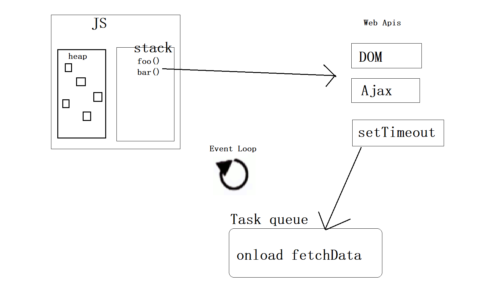

# Web基础部分:fire:

## CSS篇

### 介绍一下flex布局

弹性布局，主要分为主轴和交叉轴，

常用的属性主轴有`justify-content`，设置主轴上的排列方式，取值有`flex-start|flex-end|center|space-around|space-evenly|space-between`

`flex-direction`用于切换主轴交叉轴方向，取值有`row|column|row-reverse|column-reverse`

`flex-wrap`设置是否换行，默认不换行，取值有`wrap|no-wrap`

`flex-flow`是`flex-direction和flex-wrap`的组合写法

交叉轴上常用的属性`align-items&align-content&align-self`

`align-items`设置交叉轴子元素的排列方式，默认`stretch`，可取值`flex-start|flex-end|center`，`align-center`与`align-items`的区别主要在于`align-content`是用于修饰多行的，后者是单行

`align-self`是修饰子元素的，设置元素本身的排列方式

`flex`属性是`flex-grow|flex-shrink|flex-basis`三个属性组成的，分别表示放大的比例，缩小的比例和基数，`flex: 1;`**展开是`flex: 1 1 auto;`或者`flex: 1 1 0%;`**

`order`属性用来改变子元素的排列顺序，**无序的优先排列**

### `BFC`

全程是`Block formating Context`，块级格式化上下文，`BFC`是一个独立的布局环境，可以理解为一个容器，这个容器内的排列不会影响其它环境，如果一个元素符合触发`BFC`的条件，则`BFC`中的元素布局不受外部影响

可以解决`margin重叠，margin塌陷问题`，`BFC`的高度包括浮动元素的高度

设置成`bfc`容器的条件

> overflow: hidden|auto|scroll;
>
> float: left|right;
>
> position: absolute|fixed;
>
> display: flex|inline-block;

### 清除浮动的几种方式

浮动指非ID浏览器下，容器不设高度且子元素浮动时，容器高度不能被内容撑开，此时，内容会溢出到容器外面而影响布局，这种现象被称为浮动（溢出）

工作原理：

* 浮动元素脱离文档流，不占据空间
* 浮动元素碰到包含它的边框或者其他浮动元素的边框停留

引起的问题：

* 父元素高度无法被撑开，影响与父元素同级的元素
* 与浮动元素同级的非浮动元素会跟随其后
* 若浮动的元素不是第一个元素，则该元素之前的元素也要浮动，否则会影响页面显示结构

清除浮动方式

* 给父级定义height属性
* 浮动元素之后添加一个空的div标签，添加clear:both样式
* 包含浮动元素的父级标签添加overflow: hidden或者auto
* 使用:after

### 重绘和回流

回流，元素规模尺寸，布局，隐藏新增等改变会导致回流，浏览器会使重新渲染树中受到影响的部分失效，并重新构造这部分渲染树，完成回流，会重新绘制受影响的部分到屏幕中，完成回流后，重绘受影响部分

重绘，一些元素的更新只影响元素的外观，风格，不会影响布局

浏览器维护了一个队列，会把所有引起回流、重绘的操作放入这个队列，队列中任务到了一定数量或者到了一定时间间隔，浏览器就会清空队列，进行批处理，这样会将多次重绘回流变成一此重绘回流

### inline和block

1. 行内级和块级
2. 行内级不可设置高度宽度，是文字的高度
3. 块级会占据一行可以设置高度宽度

### 盒模型

主要分为两种，标准盒模型和IE怪异盒模型

#### 标准盒模型

总元素的宽度=宽度+左填充+右填充+左边框+右边框+左边距+右边距


#### (IE)怪异盒模型

总元素的宽度=宽度+左边距+右边距


### 选择器

| 选择器         | 格式          | 权重 |
| -------------- | ------------- | ---- |
| ID选择器       | #id           | 100  |
| 类选择器       | .class        | 10   |
| 属性选择器     | a[ref='xxx']  | 10   |
| 伪类选择器     | li:last-child | 10   |
| 标签选择器     | div           | 1    |
| 伪元素选择器   | li:after      | 1    |
| 相邻兄弟选择器 | h1 + p        | 0    |
| 子选择器       | ul > li       | 0    |
| 后代选择器     | li a          | 0    |
| 通配符选择器   | *             | 0    |

#### 深度选择器

选择器名会进行哈希，必须通过深度选择器才可以正确选择中对应的元素

CSS中使用 `>>>`

less及sass等预编译语言中使用/deep/

### 不可以被继承的CSS属性

1. display
2. 文本属性
   1. vertical-align
   2. text-decoration
   3. text-shadow
   4. white-space
   5. unicode-bidi
3. 盒子模型属性：width、height、margin、border、padding
4. 背景属性：background、background-color、background-image、background-repeat、background-positon、background-attachment
5. 定位属性：float、clear、position、top、right、bottom、left、min-width、max-width、max-heigth、overflow、clip、z-index
6. **生成内容属性**：content、counter-reset、counter-increment
7. **轮廓样式属性**：outline-style、outline-width、outline-color、outline
8. **页面样式属性**：size、page-break-before、page-break-after
9. **声音样式属性**：pause-before、pause-after、pause、cue-before、cue-after、cue、play-during

### 可以被继承的css属性

1. 字体系列属性
   1. font-family
   2. font-weight
   3. font-size
   4. font-style
2. 文本系列
   1. text-indent
   2. text-ailgn
   3. line-height
   4. word-spacing
   5. letter-spacing
   6. text-transform
   7. color
3. 元素可见性
   1. visibility
4. 列表布局
   1. list-style
5. 光标
   1. cursor

### 定位

`position: absolute|fixed|sticky|relative|static;`

### 垂直居中的多种方式

```css
.flex {
    display: flex;
    justify-content: center;
    align-items: center
}
.flex1 {
    display: flex;
}
.flex1 > .box {
    margin: auto;
}
.posi {
    position: relative;
}
.posi > .box {
    position: absolute;
    top: 50%;
    left: 50%;
    transform: translate(-50%, -50%);
}
```


### css3的transform会引起重绘还是回流

使用GPU加速，不会引起重绘回流

### display和visibility的区别

## JS篇

### 介绍一下`event-loop`事件循环

JavaScript是一门单线程语言(JavaScript主要用途是与用户互动，以及操作DOM，因此决定了这只能是单线程)

#### 任务队列

任务可以分为两种，同步任务(synchronous)和异步任务(asynchronous)

同步任务：只有前一个任务执行完毕，才能执行下一个任务

异步任务：不进入主线程，进入任务队列(task queue)，只有任务队列通知主线程，异步任务可以执行了，该任务才会进入主线程执行

#### **执行栈(execution context stack)**

1. 所有同步任务都在主线程执行，形成一个执行栈

2. 主线程之外，存在一个任务队列，只要异步任务有了运行结果，就在任务队列放置一个事件

3. 一旦执行栈中所有同步任务执行完毕，系统就会读取任务队列，异步任务进入执行栈，执行

主线程不断重复这三个步骤

#### Event Loop

主线程从任务队列中读取事件，这个过程是循环不断的，所以这种运行机制又称为Event Loop（事件循环）



#### requestAnimationFrame

requestAnimationFrame()方法接收一个参数，此参数是一个要在重绘屏幕前调用的函数。这个函数就是修改DOM样式以反映下一次重绘有什么变化的地方，为了实现动画循环，可以把多个requestAnimationFrame调用串联起来

当浏览器的显示频率刷新的时候，此函数会被执行，**requsetAnimationFrame的调用时间是跟着系统的刷新频率走的**

回调函数有一个参数，是一个相对的时间毫秒值，表示当前的刷新时间。

### 原型和原型链

每个对象都有对应的原型，实例对象的`__proto__`指向了构造函数的`prototype`

通过改变原型指向，可以改变对象的原型，由此形成的链式结构就是原型链

```js
function SuperType() {
    this.subs = [1, 2, 3]
}
function SubType() {}
SubType.prototype = new SuperType();
```

### 闭包原理及其用途

```js
function demo() {
    let a = 111;
    return function fn() {
        return ++a;
    }
}
```

函数demo里有一个变量a，函数执行结束之后，会返回一个函数fn，fn函数内部调用了变量a，这时就形成了闭包，此时函数执行完毕之后这块执行期上下文就不会被销毁，因为fn函数保持了对a变量的引用，所以不会被垃圾回收

- **所以需要合理使用闭包，否则会造成内存泄漏**
- 闭包提供了外部访问函数内部变量的能力
- 防止全局变量被污染

### 迭代器与生成器

ES6新增了迭代器的概念，实现Iterable接口需要支持迭代的自我识别能力和创建实现Iterator接口的对象的能力，在ES中，必须暴漏一个属性作为默认迭代器，这个属性必须使用特殊的Symbol.iterator作为键，通过调用next方法在可迭代对象中遍历数据，每次调用成功，都会返回一个IteratorResult对象，其中value和done，done是true时，表示迭代结束了

```js
function * demo() {
    yield 1
    yield 2
    yield 3
}
```

上方demo函数就是一个生成器，demo执行完毕会生成一个迭代器，函数执行到yield关键字会暂停，只有执行next方法才会继续执行

### promise

promise是现代异步编程的一种新的解决方式，解决了以往回调函数嵌套过深的问题（回调地狱），使用的是promise的链式调用方式

```js
function(fn() {
    fn1() {
        fn2(){
            fn3(){
                fn4(){
                    fn5(){
                        fn6(){
                            //....
                        }
                    }
                }
            }
        }
    }
})
// promise形式
return new Promise(resolve => {
    resolve(1)
}).then(value => {
    return value
}).then(value => {
    return value
})
// ...
```


[promise用法](../web/promise.html)

[手撕promise源码](../web/my-promise.html)

### async和await

是现代异步编程的最终解决方案，可以以写同步代码的形式写异步代码，易读性非常强

`async`是生成器`generator`的语法糖，async用于修饰函数，将返回一个promise对象，await与yield关键字类似，后面最好跟一个promise，会直接拿到promise的值，若promise为rejected状态，需要使用try/catch包括，捕获对应的错误信息，如果await后面跟的不是promise，那么将值作为成功状态的promise值即可，await语句后面的语句相当于promise.then()，如下方代码所示。

```js
async function async1() {
  console.log('A');
  await async2()
  console.log('B');
}

function async1() {
    console.log('A');
    async2().then(value => {
        console.log('B')
    })
}
```

### JavaScript的几种继承模式

#### 原型链继承

原型链继承，每个对象都有一个原型，可以从原型上继承属性方法，这就是原型链继承

缺点：

​	对于引用类型的值来说，多个继承同一个原型，改一发动全身，各自之间是不独立的。如下方代码所示

```js
function SuperType() {
    this.property = true;
    this.likes = ['runing', 'basketball', 'baseball']
}
SuperType.prototype.getSuperValue = function() {
    return this.property;
}
function SubType() {
    this.subproperty = false
}
// 继承SuperType
SubType.prototype = new SuperType();
SubType.prototype.getSubValue = function() {
    return this.subproperty;
}
const sub = new SubType();
const sub1 = new SubType();
sub.likes.push('swim')
// 修改了sub，sub1也会收到影响
```

#### 盗用函数继承

在函数内部调用别的构造函数，使用call改变this指向。

缺点：

​	必须在构造函数中定义方法，因此函数不能重用，子类也不能访问父类原型上定义的方法，因此所有类型只能使用构造函数模式

```js
function SuperType() {
    this.likes = ['run', 'basketball'];
}
function SubType(age) {
    SuperType.call(this);
    this.age = age;
}

```

#### 组合继承

​	组合继承是JS中最常用的继承方式，综合原型链和盗用构造函数，思路是使用原型链继承原型上的属性和方法，通过盗用构造函数继承实例属性。这样既可以把方法定义在原型上以实现重用，又可以让每个实例都有自己的属性

```js
function SuperType(name) {
    this.name = name;
    this.colors = ['red', 'blue', 'green']
}
SuperType.prototype.sayName = function() {
    console.log(this.name)
}
function SubType(name, age) {
    // 继承属性
    SuperType.call(this, name);
    this.age = age;
}
// 继承方法
SubType.prototype = new SuperType();
SubType.prototype.sayAge = function() {
    console.log(this.age)
}
```

#### 原型式继承

```js
function object(o) {
    // 创建一个临时构造函数
    function F() {}
    F.prototype = o;
    return new F();
}
```

### var、const和let

const和let是es6新增的两个变量声明关键字，两者都有暂时性死区，声明之前不可被访问，都有块级作用域，声明后的变量不可重复被声明，const修饰的是一个常量，let修饰的可以被修改

### bigint symbol

都是新增的变量类型

biging是一种内置对象，提供一种表发来表示大于`2^53-1`的整数，它可以表示任意大的整数。

不能用于Math对象中的方法，不能和任何Number实例混合运算，两者必须转换成同一种类型，在两种类型来回转换时要小心，因为bigint变量在转换成Number变量时可能会丢失精度

使用`Symbol(xx)`会返回一个独一无二的值

`Symbol.iterator`作为迭代器的键

### 常见的类数组有哪些？如何转为数组

arguments对象和nodelist

`...和Array.from()`

`Array.prototype.slice.call(arguments) [].slice.call(arguments)`

### 扩展运算符，剩余参数

... 用于数组对象结构

...rest修饰函数剩余的参数，是一个数组

### new的时候发生了什么

1. 创建一个空对象
2. 空对象的`__proto__`属性指向构造函数的`prototype`
3. 执行构造函数内部代码
4. 构造函数返回值如果是一个对象就返回这个对象，否则返回第一步创建的对象

### 介绍一下浅拷贝和深拷贝

浅拷贝对于原始值是新增，对于引用类型的值，只是拷贝了引用，即拷贝的引用值有修改，那么源值也会受到影响

深拷贝对于所有属性方法都是一次新增，改新值不会影响到旧值

### 如何实现一个深拷贝

```typescript
function _completeDeepClone (target, map = new Map()){
  // 补全代码
  if (!(target instanceof Object)) return target;
  const constructor = target.constructor()
  if (/^(Function|RegExp|Date|Map|Set)$/i.test(constructor.name)) return new constructor(target)
  if (map.get(target)) return map.get(target)
  map.set(target, true)
  // const cloneTarget = Array.isArray(target) ? [] : {}
  const descs = Object.getOwnPropertyDescriptors(target);
  const cloneTarget = Object.create(Object.getPrototypeOf(target), descs)
  
  for (let prop in target) {
      if (target.hasOwnProperty(prop)) {
          cloneTarget[prop] = _completeDeepClone(target[prop], map)
      }
  }
  return cloneTarget
}
```

### 介绍一下`call/apply/bind`

都是用来改变`this`指向的，call和apply都是直接执行的，两者的参数传递不一致，apply是数组形式，call是剩余参数，bind是返回一个已绑定的函数，再次调用才会执行

### 介绍一下浏览器的垃圾回收机制

### 导致内存泄漏的情况有哪些


### typescript的type和interface的区别


### iframe的替代方案有了解过哪些

1. object标签

   ```html
   <object data="https://https://www.baidu.com" width="400" height="300" type="text/html">
       Alternative Content
   </object>
   ```

   

2. embed

   ```html
   <embed src="https://www.baidu.com" width=200 height=200 />
   ```

   

### 介绍一下RSA和MD5

RSA公钥是被公开的，要想得出明文，必须使用私钥破解

MD5加密可用来将密文保存在数据库，在认证时计算出密文判断二者是否一致

### proxy除了代理还能做什么，监听数据除了proxy和，defineProperty还能如何做

1. mutation observe

### **`common JS`和`esmoduleJS`的区别**

1. CommonJS 模块输出的是一个值的拷贝，ES6 模块输出的是值的引用。
2. CommonJS 模块是运行时加载，ES6 模块是编译时输出接口。
2. CommonJS模块的require()是同步加载模块，ES6模块的import命令是异步加载，有一个独立的模块依赖的解析阶段

CommonJS加载的是一个对象（即module.exports属性），该对象只有在脚本运行完才会生成。而ES6模块不是对象，他的对外接口知识一种静态定义，在代码静态解析阶段就会生成

CommonJS模块输出的是值的引用，模块内部的变化影响不到这个值

### defer和async

`defer`是“渲染完再执行”，`async`是“下载完就执行”

