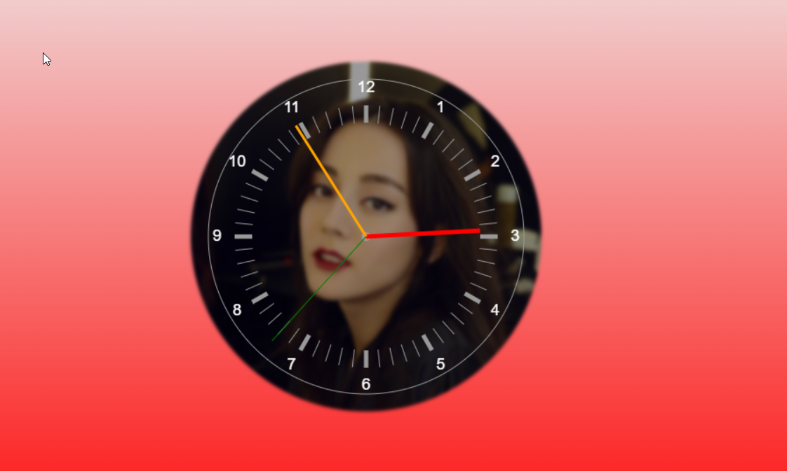

# Html

## 简介

(HyperText Markup Language) 超文本标记语言，是web前端的结构部分，由一系列元素标签组成

\<!DOCTYPE> 是文档声明

H5不基于SGML，故不需要引用DTD

按照排列方式，HTML元素可分为块级元素和行内元素

​	块级元素独占一行，不能与其他任何元素并列，可设置宽高，默认是父级宽度，常见块元素： `div h li p` CSS属性: `display: block;`

​	行内元素与其他行内元素并排，不能设置宽高，默认是文字宽度：` span a u em` CSS属性：`display: inline`

## 常用标签

table，表格，在使用HTML打印时，thead、tfoot标签可以在页面头部，尾部添加指定内容

iframe，用于嵌入其他HTML页面，src属性指定的url就是要嵌入的页面链接

> src 嵌入页面的URL
>
> width 嵌入页面的宽度
>
> height 嵌入页面的高度

iframe元素挂载完成后通过`postMessage`与嵌入的页面进行通信


## HTML5

* 新增用于绘画的canvas元素
* 用于媒体播放的video和audio元素
* 新增localStorage和sessionStorage支持存储
* 新增语义化标签`article、footer、header、nav、section`


### Canvas

常用api

| api                                      | 参数                                                         | 描述                                                         |
| ---------------------------------------- | ------------------------------------------------------------ | ------------------------------------------------------------ |
| clearRect(x, y, width, height)           | x坐标，y坐标，宽度，高度                                     | 清除指定的区域                                               |
| save()                                   |                                                              | 保存，入栈                                                   |
| translate(x, y)                          | x坐标，y坐标                                                 | 移动原点位置到指定坐标，移动后原点坐标会发生变化             |
| beginPath                                |                                                              | 开始描绘新的路径，否则旧的路径也会一起描绘                   |
| strokeStyle                              |                                                              | 可以是字符串、渐变对象或图案对象，默认值为"#000000"          |
| arc(x,y,radius,startAngle,endAngle,wise) | x坐标，y坐标，半径，开始角度，结束角度，是否逆时针(默认顺时针) | xy坐标为中心，radius为半径，绘制弧线，起始角度start，结束角度end |
| stroke                                   |                                                              | 绘制路径                                                     |
| rotate(deg)                              |                                                              | 围绕原点旋转弧度                                             |
| moveTo(x, y)                             | xy坐标                                                       | 将绘制光标移动到指定坐标                                     |
| lineTo(x, y)                             | xy坐标                                                       | 绘制一条从上一点到xy坐标的线                                 |
| textAlign                                | "start"、"end"、<br />"left"、"right"、"center"              | 设置水平文字排列方式                                         |
| textBaseline                             | "top" 、 "hanging" 、 "middle" 、"alphabetic"、"ideographic<br />、"bottom" | 设置垂直方向文字排列方式                                     |
| font                                     | 字体样式                                                     | CSS 语法指定的字体样式、大小、字体族                         |
| fillStyle                                | 填充区域的样式                                               | 可以是字符串、渐变对象或图案对象，默认值为"#000000"          |
| fill                                     | 填充                                                         |                                                              |
| fillText(str, x, y)                      | 要绘制的字符串、x 坐标、y 坐标                               |                                                              |
| restore                                  |                                                              | 出栈                                                         |
|                                          |                                                              |                                                              |


小demo[在线预览](http://blairq.gitee.io/canvas-clock)



难点：

> 十二个数字摆放位置（运用三角函数`Math.cos和Math.sin`）
>
> 出入栈（save和restore的使用）
>
> 秒针最后绘制避免被覆盖


### Web Worker

Javascript是单线程模型，WebWorker就是为Javascript创建多线程环境，允许多线程创建Worker线程，将一些任务分配给后者运行，在主线程运行的同时，Worker线程在后台运行，两者互补干扰，等到Worker线程完成计算任务，再把结果返回给主线程

注意点:

1. 同源策略
2. DOM限制，无法读取DOM对象，可以使用navigator对象和location对象
3. 通信联系 Worker线程与主线程不在同一个上下文环境，不能直接通信，必须通过消息完成
4. 脚本限制 不能执行alert confirm方法，但是可以发送Ajax请求
5. 文件限制 不能打开本地文件系统

#### 用法

使用new命令，调用Worker构造函数，新建Worker线程

参数是一个脚本文件，不能读取本地文件，所以脚本必须来自网络

主线程通过postMessage向Worker发消息，通过onmessage指定监听函数，接受子线程发回来的消息

```js
const worder = Worker('work.js')
worker.postMessage('message') // 可以是各种数据类型
// 收消息
worker.onmessage = function(event) {
  doSomething()
}
//关闭
worker.terminate()
```

Worker线程

内部有一个监听函数，监听message事件，self指的是worker线程自身

```js
self.addEventListener('message', function(e) {
  self.postMessage(e)
}, false)
// 关闭子线程
self.close()
```

worker加载脚本使用importScripts()，可同时加载多个脚本

**错误处理**

主线程中可以监听Worker是否发生错误，若发生错误，会触发error事件

```js
worker.onerror(function(event) {
  console.error(event)
})
```


